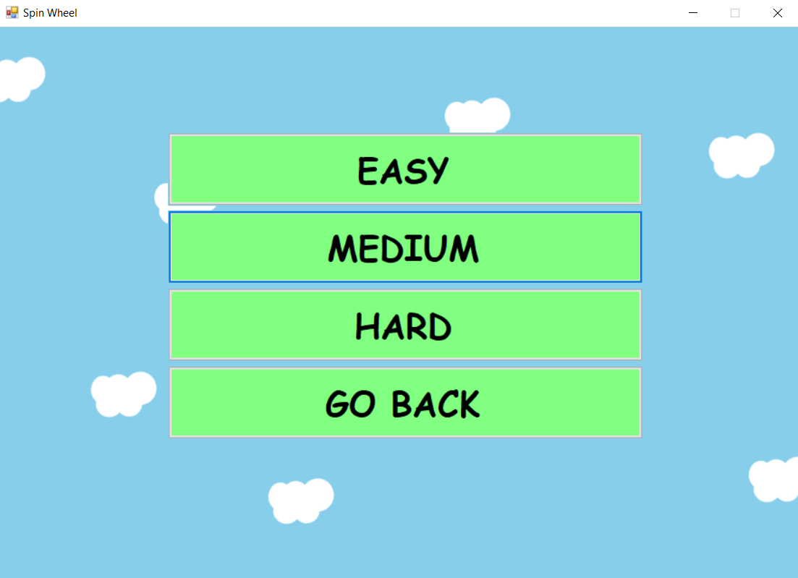

# SpinWheel  (Wheel of Fortune "Çarkıfelek" replica)

## **INTRODUCTION**
Spin Wheel is a Windows Forms Application puzzle game. In the game, I had to create solutions to make the items move, rotate or change their visibility depending on the user input. These items are PictureBoxes, Buttons, TextBoxes or Labels. To add functionality to these items, certain methods are used multiple times in Timers. There are Timers for each specific function of the game. These are the basic structures of this game project. 

 

There are multiple forms in the game (3 in total) and these two above are created to make the game more user friendly. When “PLAY” button is clicked, it creates the second form object and hides the first one.

## **GAMEPLAY**
When the difficulty is selected on the second screen, the same process executed and another form object is created for game screen. When the game is started, there will be an animation at first then puzzles will be shown with their types. Throughout the game, we will be using “GUESS” and “SPIN”  to solve the puzzles.

 

## **SPIN AND SOLVING PUZZLES**
Since Windows Forms applications only have 90, 180 and 270 degrees of rotation for the PictureBoxes, I first tried to overwrite the Paint event in C# but that didn’t work for me. The image wasn’t rotating properly and smoothly. Then I tried a longer solution that I used photoshop to create 90 images with 1 degrees apart from each other. After loading all the images to a PictureBox array and using this array, I obtained a smoother rotation by changing the visibilities one by one. 

After getting the output from the spin, it comes back to the puzzle screen with an animation. Then the “LETTER” button will be visible and we click on it to see the letters. After that, selected letter will be displayed on the screen if there is any in the current puzzle.

 

Note: For practicality, puzzles are in Turkish even though UI is in English.

